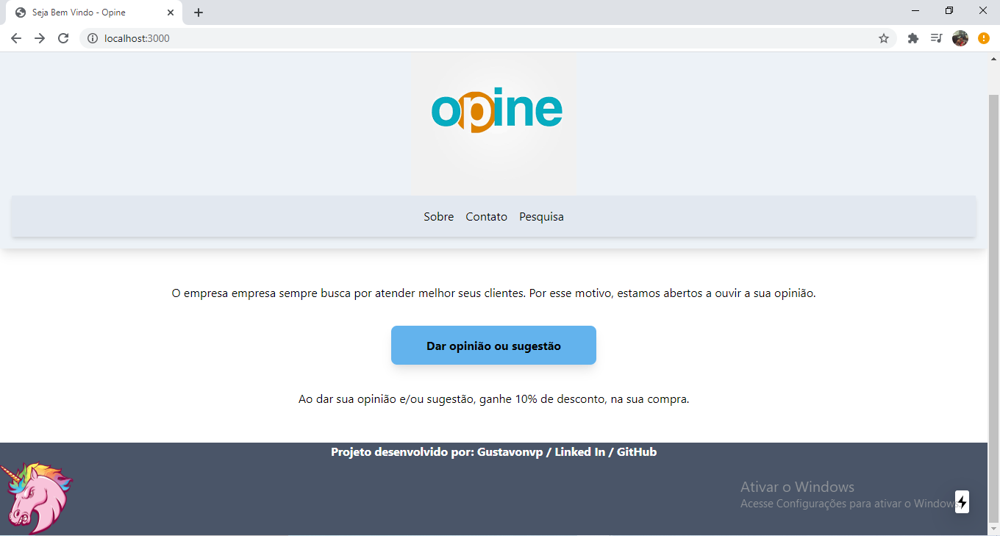

# Opina Ai

- [x] Instalar dependências npm/yarn
- [x] configurar dependência do tailwindcss e do postcss
- [x] caso queira, utilizar o purgecss (dependência) para eliminar o css não utilizado (tailwind e postcss)
- [x] criar componentes/páginas (...react, OutrasDependências)
- [x] criar API para se conectar com outras externamente, para rodar junto a aplicação.
- [x] configurar variáveis de ambiente, de acordo com o .env.example, ou caso tenha outras variáveis de outros ambientes se conectando a aplicação.

<h1 align="center">
  
</h1>

